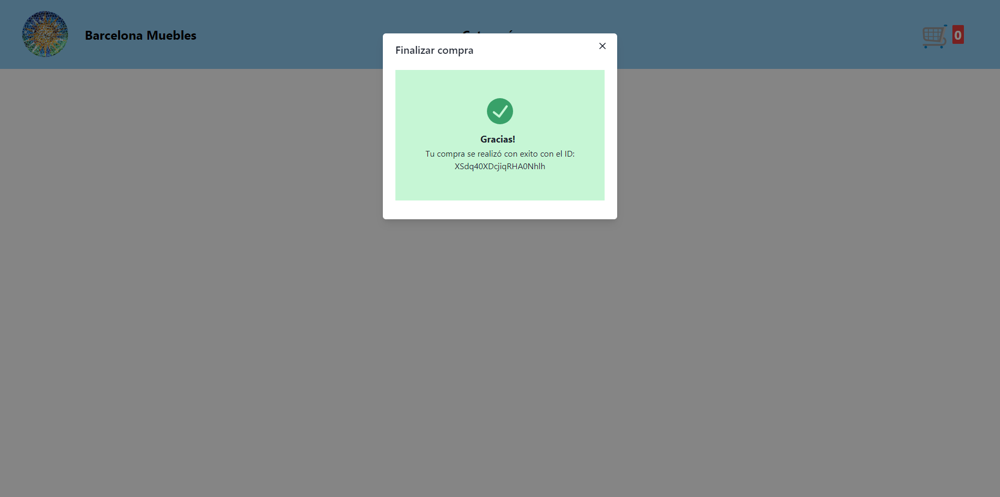

# Barcelona Muebles - Tienda de Muebles en Línea

Barcelona Muebles es una tienda en línea de muebles para el hogar donde los usuarios pueden explorar y comprar una variedad de muebles para diferentes categorías, como dormitorio, cocina y sala de estar. Este proyecto de React se centra en la creación de una interfaz de usuario intuitiva para que los usuarios naveguen por los productos, los agreguen al carrito de compras y realicen compras.

## Características

- **Exploración de productos:** Los usuarios pueden explorar una lista de productos disponibles, filtrados por categoría.
- **Agregación al carrito:** Los usuarios pueden agregar productos al carrito de compras, donde pueden ver una lista de los productos seleccionados.
- **Carrito de compras:** Los usuarios pueden ver los productos en su carrito de compras, ajustar las cantidades y eliminar productos.
- **Finalización de la compra:** Los usuarios pueden finalizar sus compras proporcionando información de correo electronico.
- **Interfaz atractiva:** El proyecto utiliza el framework Chakra UI para una interfaz de usuario elegante y receptiva.

## Capturas de Pantalla

## Tecnologías Utilizadas

- React: Para construir la interfaz de usuario de la aplicación.
- React Router: Para la navegación dentro de la aplicación.
- Chakra UI: Para la creación de la interfaz de usuario y la gestión de estilos.
- Context API: Para el manejo del estado global de la aplicación.
- Promises: Para simular la carga de datos asincrónica.
- React Router: Para gestionar la navegación entre las páginas de la aplicación.

